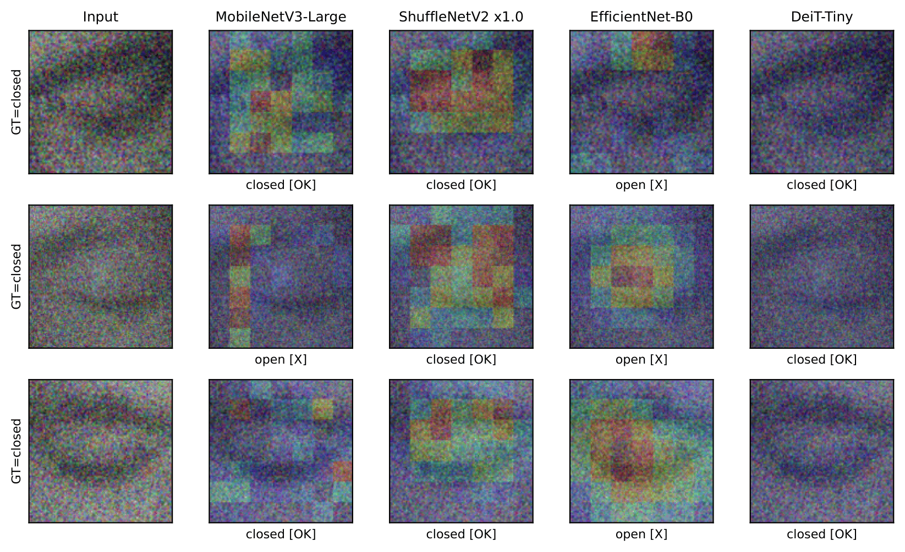
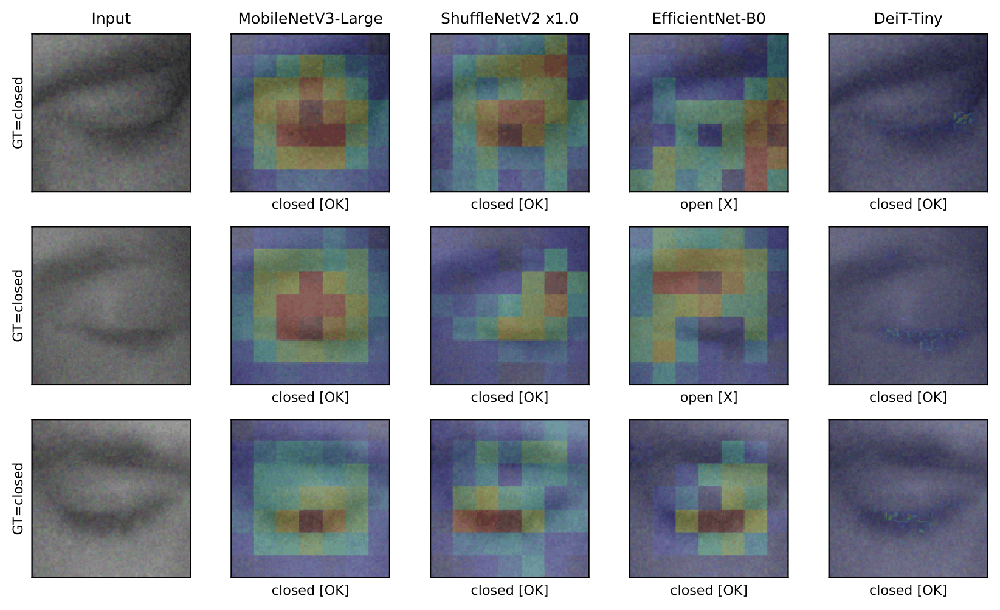
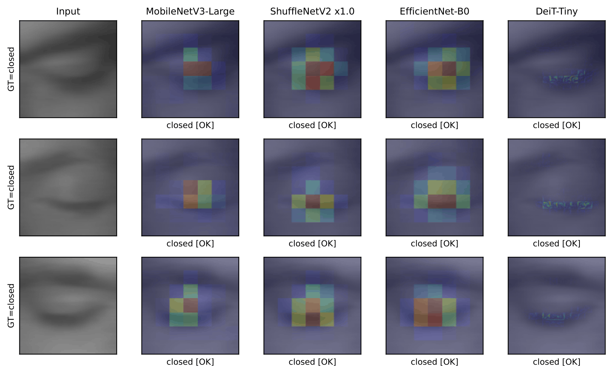
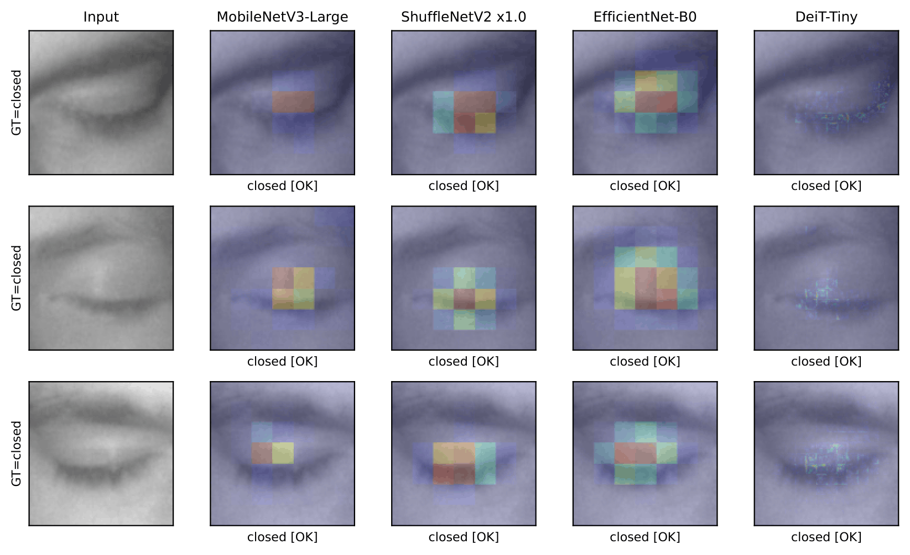
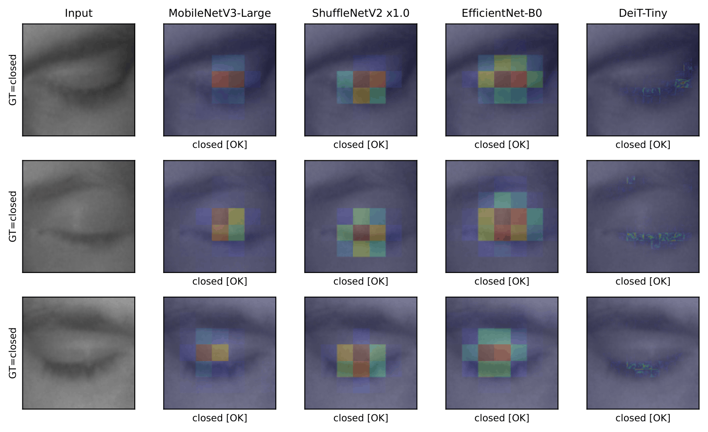

# Human-Centered Benchmarking of Vision-Based Driver Monitoring Models

[](https://www.python.org/downloads/release/python-3100/)
[](https://pytorch.org/)
[](LICENSE)

> **Official repository for the paper:**
> *"Human-Centered Benchmarking of Vision-Based Driver Monitoring Models"*
> Ruben Dario Florez-Zela | Universidad Nacional de San Agustin de Arequipa (UNSA), Arequipa, Peru

---

## Overview

This repository contains the complete implementation of the **Human-Centered Benchmarking Framework (HCBF)**, a structured methodology for evaluating vision-based driver monitoring models across four dimensions that reflect the real demands of safety-critical intelligent transportation systems.

**Key finding:** While all four architectures perform near-equivalently on clean accuracy (0.978–0.989), each leads in exactly one HCBF dimension. Critically, the three CNN-based models collapse under Gaussian noise (27–48% F1 retention), whereas DeiT-Tiny retains 92%, and the collapse occurs in the most hazardous direction, misclassifying closed eyes as open. A benchmark restricted to clean accuracy would offer no warning of this vulnerability.

---

## The HCBF at a Glance

| Dimension | Metrics | Equation |
|---|---|---|
| **Accuracy** (α) | Top-1, Macro F1, AUC-ROC | Mean of three metrics |
| **Explainability** (ε) | Deletion AUC ↓, Insertion AUC ↑ | ½ · ((1 − Del) + Ins) |
| **Efficiency** (η) | Params (M), FLOPs (G), Latency (ms) | 1 − mean of min-max normalized costs |
| **Robustness** (ρ) | F1 retention under 9 perturbation conditions | Mean retention across conditions |

The **Human-Centered Score (HCS)** aggregates the four dimensions under three deployment-oriented weighting scenarios:

| Scenario | α | ε | η | ρ | Context |
|---|---|---|---|---|---|
| HCS-A (Safety) | 0.30 | 0.20 | 0.20 | 0.30 | High-risk ADAS |
| HCS-B (Deployment) | 0.25 | 0.20 | 0.35 | 0.20 | Edge hardware |
| HCS-C (Balanced) | 0.25 | 0.25 | 0.25 | 0.25 | Neutral reference |

---

## Results Summary

### HCBF Profiles (normalized, higher is better)

| Model | α (Acc) | ε (Expl) | η (Eff) | ρ (Rob) | HCS-A | HCS-B | HCS-C |
|---|---|---|---|---|---|---|---|
| MobileNetV3-Large | **0.989** | 0.560 | 0.710 | 0.804 | 0.7920 (2) | 0.7687 (2) | 0.7659 (2) |
| ShuffleNetV2 x1.0 | 0.978 | 0.606 | **1.000** | 0.819 | **0.8604 (1)** | **0.8795 (1)** | **0.8508 (1)** |
| EfficientNet-B0 | 0.980 | **0.754** | 0.354 | 0.750 | 0.7407 (4) | 0.6698 (3) | 0.7096 (4) |
| DeiT-Tiny | 0.987 | 0.606 | 0.287 | **0.959** | 0.7625 (3) | 0.6603 (4) | 0.7099 (3) |

All four models lie on the **Pareto frontier**: no model dominates all others simultaneously.

### Robustness Under Gaussian Noise (critical finding)

| Model | Mild (σ=10) | Moderate (σ=25) | Severe (σ=40) | Mean retention |
|---|---|---|---|---|
| MobileNetV3-Large | 0.471 | 0.526 | 0.400 | 0.466 |
| ShuffleNetV2 x1.0 | 0.482 | 0.482 | 0.489 | 0.484 |
| EfficientNet-B0 | 0.294 | 0.272 | 0.238 | **0.268** |
| DeiT-Tiny | **0.995** | 0.937 | 0.839 | **0.923** |

---

## Qualitative Results (Grad-CAM)

The figures below show saliency maps under different perturbation conditions.
Each row is one test example (ground-truth: *closed*);
columns are: Input, MobileNetV3-Large, ShuffleNetV2, EfficientNet-B0, DeiT-Tiny.

### Gaussian noise: severe (σ = 40) · *paper Fig. 2*


The eyelid contour remains visible to a human observer, yet the three CNNs
misclassify closed eyes as *open* (the more dangerous error). DeiT-Tiny
maintains correct predictions throughout.

### Gaussian noise: mild (σ = 10)


Even mild noise disrupts the CNN attribution maps, while the transformer
retains a focused response on the eyelid region.

### Motion blur: severe (kernel = 17 px)


All models handle motion blur well (>0.94 F1 retention on average), and the
saliency maps remain coherent across architectures.

### Brightness shift: severe (factor = 1.5, glare)


Brightness shifts have minimal impact on any architecture, consistent with
the robustness table results.

### Clean baseline (no perturbation)


Under clean conditions all models correctly classify the examples and produce
focused attribution maps over the eyelid region.

> **Note on dataset images:** The MRL Eye Dataset has its own terms of use.
> This repository does not redistribute the full dataset. The qualitative figures
> are provided only as derived visualizations for reproducibility of the paper.
> Users should download the original dataset from the official website to reproduce
> the experiments.

---

## Repository Structure

```
hcbf/
├── config.py               # All hyperparameters and paths
├── dataset.py              # MRL loading, subject-level split, perturbations
├── models.py               # Four architectures with replaced heads
├── train.py                # Two-stage fine-tuning, early stopping
├── evaluate.py             # Four HCBF dimensions (Eqs. 2–5)
├── analysis.py             # Pareto frontier, HCS, tables, radar chart
├── gradcam_figures.py      # Qualitative saliency maps (transposed layout)
├── requirements.txt        # Python dependencies
├── results/
│   ├── raw_results.json        # Raw per-dimension metrics (all models)
│   ├── analysis_summary.json  # Normalized profiles, Pareto, HCS
│   └── figures/               # Generated figures (PNG)
└── README.md
```

### Script → paper mapping

| Script | Paper section | Generated output |
|---|---|---|
| `train.py` | Sec. 4.3 | `results/checkpoints/*.pt` (not included; generated after training) |
| `evaluate.py` | Sec. 3.2–3.5 | `results/raw_results.json` |
| `analysis.py` | Sec. 6 | Tables 6–7, radar chart (Fig. 3) |
| `gradcam_figures.py` | Sec. 5.4 | Saliency figures (Fig. 2) |

---

## Installation

```bash
git clone https://github.com/rubendflorezzela/hcbf-driver-monitoring.git
cd hcbf-driver-monitoring
python3 -m venv venv
source venv/bin/activate        # Windows: venv\Scripts\activate
pip install -r requirements.txt
```

Requires Python 3.10+ and a CUDA-capable GPU for training (CPU also supported, but slower).

---

## Dataset

This repository uses the **MRL Eye Dataset** (Fusek, ACIVS 2018):

> Fusek, R.: Pupil localization using geodesic distance. In: Advances in Visual Computing.
> Lecture Notes in Computer Science, vol. 11241, pp. 433–444. Springer (2018).
> https://doi.org/10.1007/978-3-030-03801-4_38

**Download:** https://mrl.cs.vsb.cz/eyedataset.html

After downloading, set the path:

```bash
export MRL_DATA_DIR=/path/to/mrlEyes_2018_01
```

Or edit `DATA_DIR` directly in `config.py`.

**Supported layouts:**

| Layout | Description | Split type |
|---|---|---|
| **(A) Original MRL flat** | Encoded filenames: `sXXXX_YYYYY_..._eyestate_...png` | Subject-level ✓ |
| **(B) Folder-based** | `Open_Eyes/` and `Close_Eyes/` subfolders | Image-level (fallback) |

> Layout (A) is required to reproduce the subject-level split reported in the paper.
> Using Layout (B) will overestimate performance due to data leakage across subjects.

---

## Reproducing the Paper Results

### Full pipeline

```bash
# Step 1 — Train all four models (~5-8 h on GPU, dataset on HDD)
python train.py --model all

# Step 2 — Evaluate all four HCBF dimensions
python evaluate.py --model all

# Step 3 — Pareto analysis, HCS, LaTeX tables and radar chart
python analysis.py

# Step 4 — Failure case analysis figure (transposed: rows=examples, cols=models)
python gradcam_figures.py --n 3 --perturb noise --severity 2
```

### Generating all qualitative figures

```bash
python gradcam_figures.py --n 3 --perturb noise      --severity 2  # paper Fig. 2
python gradcam_figures.py --n 3 --perturb noise      --severity 0  # noise mild
python gradcam_figures.py --n 3 --perturb noise      --severity 1  # noise moderate
python gradcam_figures.py --n 3 --perturb blur       --severity 2  # motion blur
python gradcam_figures.py --n 3 --perturb brightness --severity 2  # brightness glare
python gradcam_figures.py --n 3 --perturb clean      --severity 0  # clean baseline
```

### Quick smoke test (one model, skip explainability)

```bash
python train.py --model shufflenetv2
python evaluate.py --model shufflenetv2 --skip_explain
python analysis.py
```

### Using pre-computed results

```bash
# raw_results.json is already included — skip training and evaluation
python analysis.py
```

### Expected outputs

| File | Description |
|---|---|
| `results/raw_results.json` | Per-dimension raw metrics for all models |
| `results/analysis_summary.json` | Normalized profiles, Pareto frontier, HCS |
| `results/figures/radar_profiles.pdf` | Figure 3 (radar chart) |
| `results/figures/gradcam_noise_s2.pdf` | Figure 2 (failure case analysis) |

---

## Experimental Configuration

Key settings in `config.py` (all match Section 4 of the paper):

```python
SEED              = 42
BATCH_SIZE        = 32
MAX_EPOCHS        = 30
WARMUP_EPOCHS     = 5       # head-only epochs before unfreezing backbone
LR                = 1e-4
LR_MIN            = 1e-6
WEIGHT_DECAY      = 1e-2
EARLY_STOP_PATIENCE = 5

GAUSSIAN_SIGMAS      = [10, 25, 40]    # noise severity levels
BRIGHTNESS_FACTORS   = [0.5, 0.7, 1.5]
MOTION_BLUR_KSIZES   = [5, 11, 17]

HCS_SCENARIOS = {
    "HCS-A (Safety)":     {"alpha": 0.30, "eps": 0.20, "eta": 0.20, "rho": 0.30},
    "HCS-B (Deployment)": {"alpha": 0.25, "eps": 0.20, "eta": 0.35, "rho": 0.20},
    "HCS-C (Balanced)":   {"alpha": 0.25, "eps": 0.25, "eta": 0.25, "rho": 0.25},
}
```

> **Windows users:** set `NUM_WORKERS = 0` in `config.py` to avoid
> PyTorch DataLoader multiprocessing issues on Windows.

---

## Software Environment

| Component | Version |
|---|---|
| Python | 3.10 |
| PyTorch | 2.1 |
| Captum | 0.7 |
| thop | 0.1.1 |
| OpenCV | 4.9 |
| timm | 0.9.12 |
| Random seed | 42 (all experiments) |

---

## Notes on Reproducibility

All reported metrics are single-run results obtained under a fixed random seed, pretrained initialization, and fixed test set. Small numerical differences may occur across hardware or library versions, especially for latency, stochastic perturbations,
and attribution methods.

Latency was measured on a desktop CPU (mean over 1,000 forward passes, pre-loaded tensors) to reflect worst-case embedded deployment without a dedicated GPU.

The explainability dimension is the most time-intensive step (~30–60 min on a mid-range GPU for all four models at `N_EXPLAIN_SAMPLES = 500`). Use `--skip_explain` for a quick check of the other three dimensions.

---

## Citation

If this work is useful for your research, please cite:

```bibtex
@misc{florezzela2026hcbf,
      title={Human-Centered Benchmarking of Driver Monitoring Models}, 
      author={Florez-Zela, Ruben Dario},
      year={2026},
      eprint={2606.08123},
      archivePrefix={arXiv},
      primaryClass={cs.CV},
      url={https://arxiv.org/abs/2606.08123}, 
}
```

---

## Related Work

- Florez, R., et al. (2024): *A Real-Time Embedded System for Driver Drowsiness Detection Based on Visual Analysis of the Eyes and Mouth Using Convolutional Neural Network and Mouth Aspect Ratio*, Sensors 24(19), 6261. https://doi.org/10.3390/s24196261
- Florez, R., et al. (2023): *A CNN-Based Approach for Driver Drowsiness Detection by Real-Time Eye State Identification*, Applied Sciences 13(13), 7849. https://doi.org/10.3390/app13137849

---

## License

This project is licensed under the MIT License. See [LICENSE](LICENSE) for details.

The MRL Eye Dataset has its own license. Refer to the
[dataset website](https://mrl.cs.vsb.cz/eyedataset.html) for terms of use.

---

## Contact

**Ruben Dario Florez-Zela**
Universidad Nacional de San Agustin de Arequipa (UNSA), Arequipa, Peru
rflorezz@unsa.edu.pe | rubendfz2206@gmail.com

*RENACYT Level V Researcher*
*Research interests: Interpretable AI · Driver Monitoring · Edge Deployment · Intelligent Transportation Systems*
